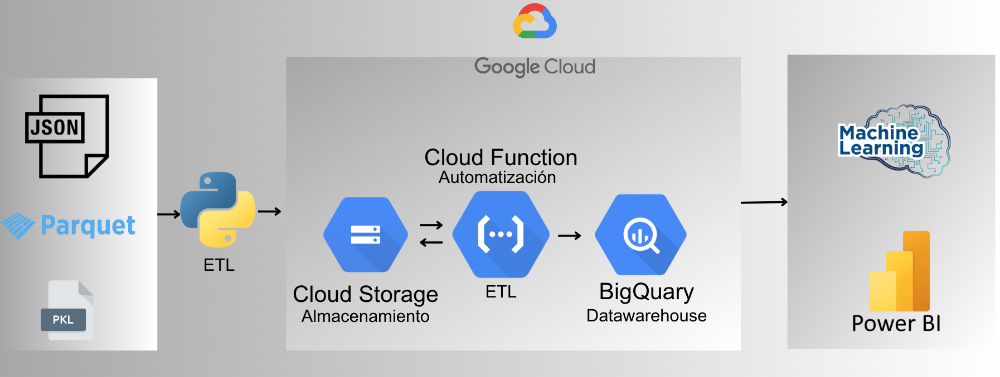
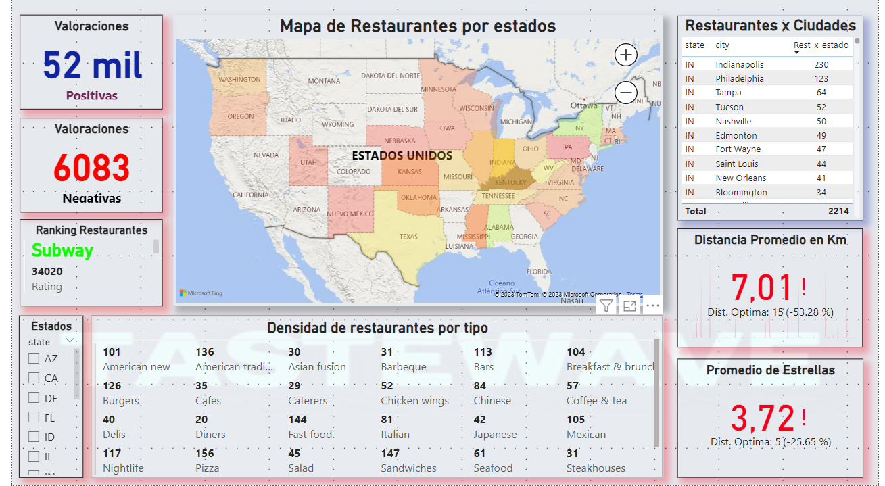
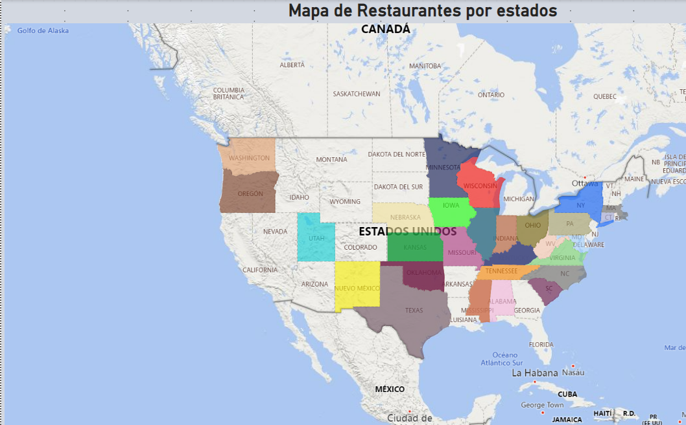

# Proyecto Data Science

## Tabla de Contenidos
- [Descripción General](#descripción-general)
- [Tecnologías Utilizadas](#tecnologías-utilizadas)
- [Ingeniería de Datos](#ingeniería-de-datos)
- [Análisis de Datos](#análisis-de-datos)
- [Sistema de Recomendación](#sistema-de-recomendación)
- [Contribuidores](#contribuidores)

## Descripción General

Un grupo de inversores está interesado en realizar inversiones en el sector de comida rápida en Estados Unidos, y nos ha contratado para el análisis del mercado de restaurantes.

Nuestro objetivo general es generar una herramienta para mostrar los resultados de la exploración del mercado con diferentes KPI’s que ayuden a la toma de decisiones en la inversión. 
También a partir de técnicas de análisis de datos, llevar a cabo la evaluación de sentimientos de los consumidores y a su vez la implementación de un modelo de aprendizaje automático, en busca de mejorar la satisfacción del cliente, la retención y el rendimiento comercial.

Por lo que se ha desarrollado una herramienta que utiliza técnicas de análisis de datos para presentar los resultados de la investigación sobre restaurantes de comida rápida en los Estados Unidos. El propósito de esta herramienta es evaluar el éxito de un negocio según su tipo, con el objetivo de mejorar la satisfacción del cliente, la retención de clientes y el rendimiento comercial al abrir nuevas sucursales o desarrollar nuevos negocios. Además, se ha implementado un modelo de aprendizaje automático para obtener nuevos datos con el mismo fin.

Objetivos Específicos:

- 1.- Identificar insights para la apertura de nuevas sucursales.
- 2.- Identificar patrones de comportamiento de usuarios, factores clave en - reseñas positivas y negativas, y tendencias para un sistema de recomendación de restaurantes.

Informe de Alcance y Limitaciones del Proyecto

El proyecto se ha centrado en el análisis de datos de reseñas de restaurantes ubicados en los Estados Unidos, obtenidos de las plataformas Google y Yelp. El período de análisis abarcó desde 2015 hasta 2021, con un enfoque especial en los restaurantes de la categoría "Fast Food". El propósito principal de este proyecto fue la identificación de relaciones en diferentes ciudades, con la finalidad de seleccionar la mejor cadena o tipo de restaurante dentro de la mencionada categoría, con miras a futuras inversiones.

## Tecnologías Utilizadas

- Jira: Una herramienta de gestión de proyectos y seguimiento de problemas desarrollada por Atlassian, utilizada para planificar, rastrear y gestionar el trabajo en equipo.
- Python: Un lenguaje de programación ampliamente utilizado para desarrollo de aplicaciones, análisis de datos, automatización y más.
- Google Cloud Storage: uso de "buckets" para almacenar y gestionar datos de manera escalable.
- Google Cloud Function: Una función sin servidor en Google Cloud que te permite ejecutar código en respuesta a eventos, como cambios en los datos de Google Cloud Storage.
- BigQuery: Servicio de análisis de datos completamente administrado por Google Cloud. Permite realizar consultas SQL en conjuntos de datos extensos y complejos para extraer información valiosa y facilitar la toma de decisiones informadas.
- CUDA : Procesamiento en paralelo con chips de la marca NVIDIA
- NPL (Procesamiento Lenguaje Natural): Facilita a las máquinas entender y generar lenguaje humano.
- Power BI: Una herramienta de visualización de datos de Microsoft que permite crear informes interactivos y paneles de control a partir de datos empresariales.

## Ingeniería de Datos

Esta etapa comenzó con un tratamiento preliminar de datos que se puede consultar en los [Notebooks](./Notebooks/); paso esencial para garantizar que los datos estén limpios, bien estructurados y listos para su procesamiento y análisis. La etapa preliminar también permite identificar las características más relevantes para el objetivo del proyecto. Esto simplifica el pipeline al reducir la cantidad de datos que deben ser procesados y analizados en profundidad, lo que mejora la eficiencia y evita la inclusión de información redundante.

Después para generar un pipeline se definió la arquitectura de Big Data, que está respaldada por la tecnología de GOOGLE CLOUD PLATFORM, junto con la organización de datos en CLOUD STORAGE, la automatización de tareas mediante CLOUD FUNCTIONS, y la explotación de datos a través de BIG QUERY, POWER BI y aplicaciones de MACHINE LEARNING, conforma una estrategia sólida y escalable para gestionar y analizar los extensos conjuntos de datos de [YELP](https://drive.google.com/drive/folders/1TI-SsMnZsNP6t930olEEWbBQdo_yuIZF) y [GOOGLE BUSINESS](https://drive.google.com/drive/folders/1Wf7YkxA0aHI3GpoHc9Nh8_scf5BbD4DA).

La automatización de tareas se ha logrado mediante el uso de Cloud Functions. Se han desarrollado dos funciones programadas en Python:
 
[ETL_CF](./CloudFunctions/ETL_CF.py): Esta función se encarga de ejecutar el proceso de Extracción, Transformación y Carga (ETL) de los datos, asegurando su adecuada preparación para su posterior análisis.
 
[LOAD_CF](./CloudFunctions/LOAD_CF.py): Esta función se ocupa de importar los datos procesados desde el bucket que alberga los datos procesados hacia su almacenamiento en el Datawarehouse, el cual se realiza con Big Query.

Con todo el proceso iterativo se llego al siguiente Diagrama de relación de tablas y que sus variables se explican en el [Reporte_de_Ingeniería](./Ingenieria_Datos/Reporte%20de%20Ingenier%C3%ADa%20de%20Datos.pdf).

 

## Análisis de Datos

El objetivo principal de este análisis de datos es proporcionar información crítica y relevante tanto para los inversionistas interesados en la apertura de restaurantes como para los usuarios que buscan restaurantes en una zona específica, usamos para el análisis de datos dataset de Google y Yelp alojados en un Data Warehouse de Google Bigquery y como herramienrta para la visualización Microsoft PowerBI

## Dashboard

### Beneficios para los inversionistas

El análisis proporcionará a los inversionistas información valiosa para tomar decisiones informadas sobre la apertura de restaurantes. Los resultados del análisis ayudarán a los inversionistas a comprender mejor el mercado objetivo, las tendencias de la industria y la competencia.

El análisis se centrará en los siguientes aspectos clave:

- Competencia: Comprender el nivel de competencia en la zona y cómo se compara con la calidad de los restaurantes existentes.

- Tendencias del Mercado: Identificar tendencias y patrones en la industria de restaurantes en la zona.

- Competición de la industria: El análisis evaluará la competencia en la industria de los restaurantes, incluidos los tipos de restaurantes que operan en la zona.
 
### Beneficios para los usuarios

El análisis proporcionará a los usuarios información útil para tomar decisiones sobre dónde comer. Los resultados del análisis ayudarán a los usuarios a encontrar restaurantes que satisfagan sus necesidades y preferencias.

Para Usuarios:
Selección Informada: Ayudar a los usuarios a tomar decisiones informadas al elegir restaurantes, considerando factores como la calificación promedio, variedad de cocinas, precios y ubicación.

- Experiencia del Cliente: Mejorar la experiencia del cliente al proporcionar información detallada sobre los restaurantes, incluyendo opiniones y reseñas de otros usuarios.

- Accesibilidad y Proximidad: Facilitar la búsqueda de restaurantes cercanos a la ubicación del usuario.

## Retos Técnicos del Análisis de Datos
El análisis de datos en este proyecto enfrento varios desafíos técnicos para lograr sus objetivos, que fueron superados en conjunto con el equipo de Inegenieria de Datos:

- Integración de Datos: La recopilación y la integración de datos de múltiples fuentes, como Google y Yelp, pueden ser complejas debido a diferencias en formatos y estructuras de datos.

- Limpieza y Preprocesamiento: Los datos suelen contener errores, valores faltantes y redundancias que requieren una limpieza y preprocesamiento cuidadoso para garantizar la precisión de los resultados.

- Análisis Geoespacial: La identificación de restaurantes y su ubicación geográfica precisa es fundamental para la evaluación de la proximidad y accesibilidad.

- Visualización de Datos: La presentación efectiva de los KPIs en forma de tableros de control que sean fáciles de entender y utilizar tanto para inversionistas como para usuarios.

- Actualización de Datos: Mantener los datos actualizados es esencial para garantizar que las decisiones se basen en información reciente.

La superación de estos desafíos técnicos fue esencial para el éxito del proyecto y para brindar valor a los inversionistas y usuarios interesados en la industria de restaurantes en una ubicación específica.

## Sistema de Recomendación

Este proyecto presenta una interfaz de usuario diseñada para interactuar con un modelo de recomendación. A través de esta interfaz, los usuarios pueden recibir recomendaciones basadas en diferentes criterios y parámetros que se ajusten a sus necesidades.

### Modelo de recomendacion
- Python: Lenguaje principal para el desarrollo del backend.
- Numpy: Utilizado para cálculos y manipulaciones de datos.
- Pandas: Es una librería de Python para trabajar con datos en forma de tablas flexibles llamadas DataFrames.
- PyTorch: Framework de Python para aprendizaje profundo.
- Math: Biblioteca de funciones matemáticas en Python.
- scikit-learn (sklearn): Biblioteca de Python para aprendizaje automático y minería de datos con herramientas sencillas y eficientes para análisis predictivo y modelado estadístico.

### Interfaz y despliegue

Para la creación de la interfaz de usuario (frontend) se optó por utilizar Dash, mientras que el backend se desarrolló principalmente en Python, haciendo uso de librerías como Numpy y diversas APIs de Google Cloud. El despliegue de la aplicación se realizó a través del servicio de virtualización de GCP. A continuación, se presenta un resumen de las principales herramientas y tecnologías implementadas:

- Python: Lenguaje principal para el desarrollo del backend.
- Numpy: Utilizado para cálculos y manipulaciones de datos.
- Nominatim: Biblioteca utilizada para transformar direcciones textuales en coordenadas geograficas.
- Dash: Herramienta escogida para el diseño de la interfaz de usuario.
- Google Cloud VM: Servicio utilizado para el despliegue de la aplicación.
- Cloud Translation API: Permite la traducción en tiempo real de ciertos elementos.
- Google Maps JavaScript API: Usada para integrar funcionalidades de mapas en la aplicación.
- SCP (Secure Copy Protocol) para transferir archivos entre la máquina local y la VM.

### Características de la Interfaz

La interfaz de nuestra aplicación ha sido diseñada pensando en la simplicidad y eficiencia para el usuario. Con un diseño amigable y una disposición intuitiva, garantizamos una experiencia de usuario fluida y agradable.

Características destacadas:

- Bilingüe: Nuestra interfaz es accesible y brinda soporte en dos idiomas principales: inglés y español. Esto nos permite alcanzar a una audiencia más amplia y garantizar que más usuarios puedan interactuar cómodamente con nuestra plataforma.

- Barra Lateral Deslizable: La barra lateral deslizable proporciona acceso directo a distintas secciones. Los usuarios pueden navegar fácilmente hacia los dashboards, acceder a nuestro repositorio en GitHub y contactarnos para cualquier consulta o comentario.

- Recomendaciones Personalizadas: En el corazón de nuestra interfaz se encuentra el sistema de recomendación. Aquí, los usuarios reciben sugerencias específicas basadas en sus preferencias y necesidades. Estas recomendaciones no solo son precisas sino también relevantes para garantizar la satisfacción del usuario.

- Integración con Google Maps: Para facilitar aún más la experiencia, hemos incorporado un iframe de Google Maps directamente en la interfaz. Esto permite a los usuarios obtener direcciones en tiempo real y saber cómo llegar a las ubicaciones recomendadas sin tener que abandonar la aplicación.

### Integración con el Modelo de Recomendación

La integración entre el frontend y el backend, específicamente con el modelo de recomendación, ha sido diseñada para ser fluida y eficiente, garantizando precisión y rapidez en las respuestas. A continuación, se detalla el proceso:

- Ingreso de Datos por el Usuario: La interfaz permite al usuario ingresar sus preferencias o requisitos para una recomendación. Esta entrada se realiza a través de campos de texto en el frontend donde pueden detallar lo que desean, así como proporcionar su dirección actual.

- Pre-procesamiento de Datos: Una vez recibido el input del usuario, el sistema inicia un proceso interno de transformación:

- Traducción: Si el input del usuario está en un idioma diferente al inglés, la aplicación utiliza la Cloud Translation API para traducir la entrada al inglés. Esta traducción garantiza que el sistema pueda entender y procesar correctamente la solicitud del usuario.

- Tokenización: Posterior a la traducción, el input se tokeniza en palabras clave. Este proceso permite al sistema identificar y clasificar las preferencias del usuario de manera efectiva, facilitando así la generación de recomendaciones precisas.

- Transformación de la Dirección: Paralelamente, la dirección proporcionada por el usuario se convierte en coordenadas geográficas. Para esto, se utiliza la bibilioteca "Nominatim" . Esta herramienta es esencial para transformar direcciones textuales en tuplas de coordenadas, facilitando así la integración con sistemas de mapeo y recomendación basados en ubicación.

- Consulta al Modelo de Recomendación: Con la entrada del usuario ya procesada y las coordenadas obtenidas, el sistema envia esta entrada al modelo de recomendación. Este modelo, entrenado con vastos datos, genera una lista de lugares o servicios que coinciden con las preferencias y la ubicación del usuario.

- Presentación de Resultados: Finalmente, las recomendaciones se presentan en la interfaz para que el usuario pueda visualizarlas, junto con opciones para ver cómo llegar a cada lugar recomendado gracias a la integración con Google Maps.

Esta integración entre la interfaz y el modelo de recomendación garantiza que los usuarios reciban sugerencias personalizadas y relevantes, todo en tiempo real y con la máxima precisión posible.

### Video de funcionamiento

[Ver el video](https://clipchamp.com/watch/Fu8v16wOlrX)

### Instrucciones de Instalación

- Clona este repositorio en una maquina virtual.
- Es necesario agregar la API_KEY en el archivo "callbacks.py" y en "motor_recomendacion.py".
- Navega al directorio del proyecto.
- Instala las dependencias necesarias (Se proporciona el requeriments.txt).
- Ejecuta el archivo principal para iniciar la aplicación(main.py).
- Conectarse a la interfaz a traves de la IP.

# Contribuidores
- Ingeniería de Datos - Alejandro Núñez [👉 LinkedIn](https://www.linkedin.com/in/alejandro-n%C3%BA%C3%B1ez-guzm%C3%A1n-60b20a188/)
- Ingeniería de Datos - Enzo Fuentes [👉 LinkedIn](https://www.linkedin.com/in/enzofuentes)
- Interfaz, integracion con el modelo de recomendacion y deploy de la aplicacion - Matias da Silva  [👉 LinkedIn](https://www.linkedin.com/in/matiasdasilva92/)
- Modelo de recomendacion, normalizacion de datos para el modelo - Guillermo Gallo Garcia  [👉 LinkedIn](https://www.linkedin.com/in/guillermo-patricio-gallo-garcia-0a3bb3bb/)

### Licencia

Especifica la licencia bajo la cual estás distribuyendo tu software. Puede ser una licencia de código abierto o cualquier otra que elijas.

